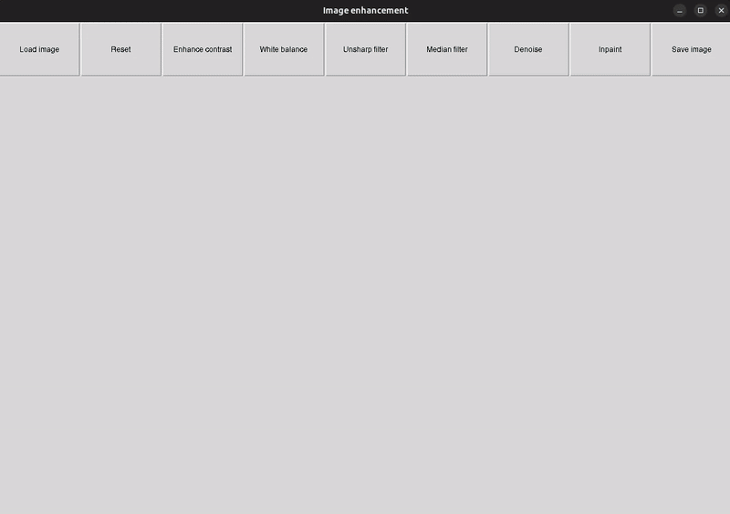

# Image Enhancement

Simple Tkinter GUI for traditiotal image enhancement techniques to function as a baseline against DL methods.

## Features
- Load and display images (auto-resizes large images)
- Enhance contrast, white balance, sharpen(smoothen), denoise
- Draw mask for inpainting
- Save enhanced image

## Usage
1. Click "Load image"
2. Apply operations using the buttons
3. For inpainting, draw mask in the popup and click "Apply"
4. Click "Save image" to write the result or "Reset" to revert to original

# More examples

